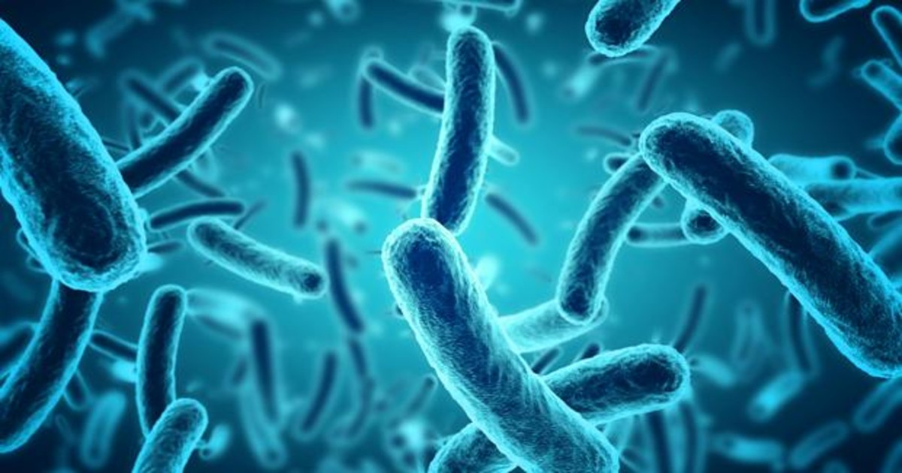

# Belly-Button-Biodiversity

 

## Introduction

This interactive dashboard seeks to explore the Belly Button Biodiversity dataset, which catalogs the microbes that colonize human navels.
The dataset reveals that a small handful of microbial species (also called operational taxonomic units, or OTUs, in the study) were present in more than 70% of people, while the rest were relatively rare.

### Tools

The following tools were used to do the web page

+ Javascript
    + D3
+ HTML
+ CSS
+ JSON

## Analysis

https://enr1que319.github.io/Dashboard-Challenge/
